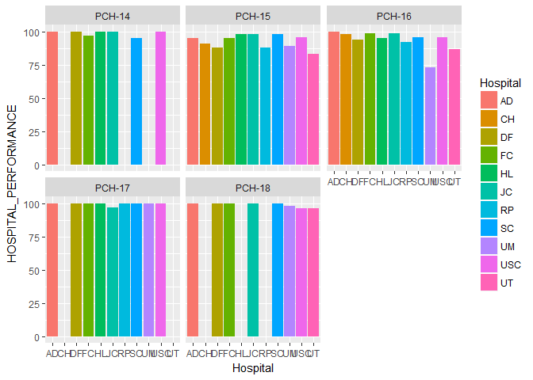
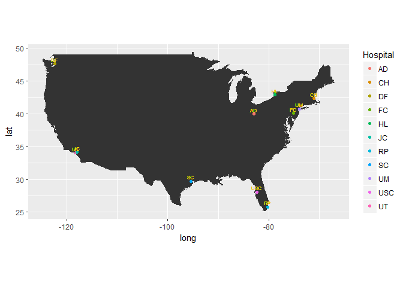

DATA607\_Prj2\_MEDICAL
================
Yun Mai
March 12, 2017

OCM Measures - PPS-Exempt Cancer Hospital
-----------------------------------------

The Prospective Payment System (PPS)-Exempt Cancer Hospital Quality Reporting (PCHQR) Program currently uses five oncology care measures. The resulting PPS-Exempt Cancer Hospital Quality Reporting (PCHQR) Program measures allow consumers to compare the quality of care given at the eleven PPS-exempt cancer hospitals currently participating in the program.

Measure\_ID: PCH-14 Oncology: Radiation Dose Limits to Normal Tissues. The numerator is defined as patients who had documentation in the medical record that radiation dose limits to normal tissues were established prior to the initiation of a course of 3D conformal radiation for a minimum of two tissues/organs. The denominator includes all patients, regardless of age, with a diagnosis of pancreatic or lung cancer receiving 3D conformal radiation therapy. There are no exclusions.

Measure\_ID:PCH-15 Oncology: Plan of Care for Pain - Medical Oncology and Radiation Oncology. The numerator is defined as the number of patient visits that included a documented plan of care to address pain. The denominator includes all visits for patients, regardless of age, with a diagnosis of cancer currently receiving chemotherapy or radiation therapy who report having pain and the pain is quantified. There are no exclusions.

Measure\_ID:PCH-16 Oncology: Pain Intensity Quantified. The numerator is defined as the number of patient visits in which pain intensity is quantified. The denominator includes all visits for patients, regardless of age, with a diagnosis of cancer currently receiving chemotherapy or radiation therapy. There are no exclusions.

Measure\_ID:PCH-17 Prostate Cancer: Adjuvant Hormonal Therapy for High Risk Prostate Cancer Patients. The numerator is defined as the number of patients who were prescribed adjuvant hormonal therapy (gonadotropin-releasing hormone \[GnRH\] agonist or antagonist). The denominator includes all patients, regardless of age, with a diagnosis of prostate cancer at high or very high risk of recurrence receiving EBRT as primary therapy to the prostate.

Measure\_ID:PCH-18 Prostate Cancer: Avoidance of Overuse of Bone Scan for Staging Low Risk Prostate Cancer Patients. The numerator is defined as the number of patients who did not have a bone scan performed at any time since diagnosis of prostate cancer at the PCH. The denominator includes all patients, regardless of age, with a diagnosis of prostate cancer at low risk of recurrence, receiving one of the following: interstitial prostate brachytherapy OR external beam radiotherapy to the prostate OR radical prostatectomy OR cryotherapy. Exclusions include medical and system reasons for having a bone scan performed.

Load pacakages
==============

``` r
library(RCurl)  
```

    ## Loading required package: bitops

``` r
library(tidyr)
```

    ## 
    ## Attaching package: 'tidyr'

    ## The following object is masked from 'package:RCurl':
    ## 
    ##     complete

``` r
library(dplyr)  
```

    ## Warning: package 'dplyr' was built under R version 3.3.3

    ## 
    ## Attaching package: 'dplyr'

    ## The following objects are masked from 'package:stats':
    ## 
    ##     filter, lag

    ## The following objects are masked from 'package:base':
    ## 
    ##     intersect, setdiff, setequal, union

``` r
library(knitr)
library(stringr)
```

    ## Warning: package 'stringr' was built under R version 3.3.3

``` r
library(ggplot2)
```

    ## Warning: package 'ggplot2' was built under R version 3.3.3

Prepare the data for further analysis
=====================================

``` r
url <- "https://raw.githubusercontent.com/YunMai-SPS/DA607-homework/master/OCM_MEDICAL_UNTIDY.csv"
PCHQR_RAW <- read.csv(url)


PCHQR1 <- PCHQR_RAW %>% 
  separate(MEASUREMENTS, c("MEASURE_ID", "MEASURE_DESCRIPTION"), sep = "/") %>% 
  separate(PERF.DENO.FTNT, c("HOSPITAL_PERFORMANCE", "DENOMINATOR", "FOOTNOTE"),sep = "/")

PCHQR1$Location.1 <- str_replace_all(PCHQR1$Location.1, "^[^\\(]*", "")
PCHQR2 <- separate(PCHQR1, Location.1, c("latitude","longtitude"),sep = ",")
PCHQR2$latitude <- str_replace_all(PCHQR2$latitude, "\\(", "")
PCHQR2$longtitude <- str_replace_all(PCHQR2$longtitude, "\\)", "")
PCHQR2$HOSPITAL_PERFORMANCE <- as.numeric(PCHQR1$HOSPITAL_PERFORMANCE)
```

    ## Warning: NAs introduced by coercion

``` r
PCHQR2$DENOMINATOR <- as.numeric(PCHQR1$DENOMINATOR)
```

    ## Warning: NAs introduced by coercion

``` r
PCHQR2 <- mutate(PCHQR2,Hospital = Hospital_Name)
hospname <- function(x){switch(x,"JAMES CANCER HOSPITAL & SOLOVE RESEARCH INSTITUTE"="JC", "CITY OF HOPE HELFORD CLINICAL RESEARCH HOSPITAL "="CH","USC KENNETH NORRIS JR CANCER HOSPITAL"="USC","HOSPITAL OF THE FOX CHASE CANCER CENTER" = "FC","MEMORIAL HOSPITAL FOR CANCER AND ALLIED DISEASES"="AD","UNIVERSITY OF MIAMI HOSPITAL AND CLINICS"="UM", "H LEE MOFFITT CANCER CENTER & RESEARCH INSTITUTE I"="HL","DANA-FARBER CANCER INSTITUTE"="DF","ROSWELL PARK CANCER INSTITUTE"="RP", "SEATTLE CANCER CARE ALLIANCE" = "SC", "UNIVERSITY OF TEXAS M D ANDERSON CANCER CENTER,THE"="UT")}

PCHQR2$Hospital <- sapply(PCHQR2$Hospital,hospname)
```

    ## Warning in switch(x, `JAMES CANCER HOSPITAL & SOLOVE RESEARCH INSTITUTE` = "JC", : EXPR is a "factor", treated as integer.
    ##  Consider using 'switch(as.character( * ), ...)' instead.

    ## Warning in switch(x, `JAMES CANCER HOSPITAL & SOLOVE RESEARCH INSTITUTE` = "JC", : EXPR is a "factor", treated as integer.
    ##  Consider using 'switch(as.character( * ), ...)' instead.

    ## Warning in switch(x, `JAMES CANCER HOSPITAL & SOLOVE RESEARCH INSTITUTE` = "JC", : EXPR is a "factor", treated as integer.
    ##  Consider using 'switch(as.character( * ), ...)' instead.

    ## Warning in switch(x, `JAMES CANCER HOSPITAL & SOLOVE RESEARCH INSTITUTE` = "JC", : EXPR is a "factor", treated as integer.
    ##  Consider using 'switch(as.character( * ), ...)' instead.

    ## Warning in switch(x, `JAMES CANCER HOSPITAL & SOLOVE RESEARCH INSTITUTE` = "JC", : EXPR is a "factor", treated as integer.
    ##  Consider using 'switch(as.character( * ), ...)' instead.

    ## Warning in switch(x, `JAMES CANCER HOSPITAL & SOLOVE RESEARCH INSTITUTE` = "JC", : EXPR is a "factor", treated as integer.
    ##  Consider using 'switch(as.character( * ), ...)' instead.

    ## Warning in switch(x, `JAMES CANCER HOSPITAL & SOLOVE RESEARCH INSTITUTE` = "JC", : EXPR is a "factor", treated as integer.
    ##  Consider using 'switch(as.character( * ), ...)' instead.

    ## Warning in switch(x, `JAMES CANCER HOSPITAL & SOLOVE RESEARCH INSTITUTE` = "JC", : EXPR is a "factor", treated as integer.
    ##  Consider using 'switch(as.character( * ), ...)' instead.

    ## Warning in switch(x, `JAMES CANCER HOSPITAL & SOLOVE RESEARCH INSTITUTE` = "JC", : EXPR is a "factor", treated as integer.
    ##  Consider using 'switch(as.character( * ), ...)' instead.

    ## Warning in switch(x, `JAMES CANCER HOSPITAL & SOLOVE RESEARCH INSTITUTE` = "JC", : EXPR is a "factor", treated as integer.
    ##  Consider using 'switch(as.character( * ), ...)' instead.

    ## Warning in switch(x, `JAMES CANCER HOSPITAL & SOLOVE RESEARCH INSTITUTE` = "JC", : EXPR is a "factor", treated as integer.
    ##  Consider using 'switch(as.character( * ), ...)' instead.

    ## Warning in switch(x, `JAMES CANCER HOSPITAL & SOLOVE RESEARCH INSTITUTE` = "JC", : EXPR is a "factor", treated as integer.
    ##  Consider using 'switch(as.character( * ), ...)' instead.

    ## Warning in switch(x, `JAMES CANCER HOSPITAL & SOLOVE RESEARCH INSTITUTE` = "JC", : EXPR is a "factor", treated as integer.
    ##  Consider using 'switch(as.character( * ), ...)' instead.

    ## Warning in switch(x, `JAMES CANCER HOSPITAL & SOLOVE RESEARCH INSTITUTE` = "JC", : EXPR is a "factor", treated as integer.
    ##  Consider using 'switch(as.character( * ), ...)' instead.

    ## Warning in switch(x, `JAMES CANCER HOSPITAL & SOLOVE RESEARCH INSTITUTE` = "JC", : EXPR is a "factor", treated as integer.
    ##  Consider using 'switch(as.character( * ), ...)' instead.

    ## Warning in switch(x, `JAMES CANCER HOSPITAL & SOLOVE RESEARCH INSTITUTE` = "JC", : EXPR is a "factor", treated as integer.
    ##  Consider using 'switch(as.character( * ), ...)' instead.

    ## Warning in switch(x, `JAMES CANCER HOSPITAL & SOLOVE RESEARCH INSTITUTE` = "JC", : EXPR is a "factor", treated as integer.
    ##  Consider using 'switch(as.character( * ), ...)' instead.

    ## Warning in switch(x, `JAMES CANCER HOSPITAL & SOLOVE RESEARCH INSTITUTE` = "JC", : EXPR is a "factor", treated as integer.
    ##  Consider using 'switch(as.character( * ), ...)' instead.

    ## Warning in switch(x, `JAMES CANCER HOSPITAL & SOLOVE RESEARCH INSTITUTE` = "JC", : EXPR is a "factor", treated as integer.
    ##  Consider using 'switch(as.character( * ), ...)' instead.

    ## Warning in switch(x, `JAMES CANCER HOSPITAL & SOLOVE RESEARCH INSTITUTE` = "JC", : EXPR is a "factor", treated as integer.
    ##  Consider using 'switch(as.character( * ), ...)' instead.

    ## Warning in switch(x, `JAMES CANCER HOSPITAL & SOLOVE RESEARCH INSTITUTE` = "JC", : EXPR is a "factor", treated as integer.
    ##  Consider using 'switch(as.character( * ), ...)' instead.

    ## Warning in switch(x, `JAMES CANCER HOSPITAL & SOLOVE RESEARCH INSTITUTE` = "JC", : EXPR is a "factor", treated as integer.
    ##  Consider using 'switch(as.character( * ), ...)' instead.

    ## Warning in switch(x, `JAMES CANCER HOSPITAL & SOLOVE RESEARCH INSTITUTE` = "JC", : EXPR is a "factor", treated as integer.
    ##  Consider using 'switch(as.character( * ), ...)' instead.

    ## Warning in switch(x, `JAMES CANCER HOSPITAL & SOLOVE RESEARCH INSTITUTE` = "JC", : EXPR is a "factor", treated as integer.
    ##  Consider using 'switch(as.character( * ), ...)' instead.

    ## Warning in switch(x, `JAMES CANCER HOSPITAL & SOLOVE RESEARCH INSTITUTE` = "JC", : EXPR is a "factor", treated as integer.
    ##  Consider using 'switch(as.character( * ), ...)' instead.

    ## Warning in switch(x, `JAMES CANCER HOSPITAL & SOLOVE RESEARCH INSTITUTE` = "JC", : EXPR is a "factor", treated as integer.
    ##  Consider using 'switch(as.character( * ), ...)' instead.

    ## Warning in switch(x, `JAMES CANCER HOSPITAL & SOLOVE RESEARCH INSTITUTE` = "JC", : EXPR is a "factor", treated as integer.
    ##  Consider using 'switch(as.character( * ), ...)' instead.

    ## Warning in switch(x, `JAMES CANCER HOSPITAL & SOLOVE RESEARCH INSTITUTE` = "JC", : EXPR is a "factor", treated as integer.
    ##  Consider using 'switch(as.character( * ), ...)' instead.

    ## Warning in switch(x, `JAMES CANCER HOSPITAL & SOLOVE RESEARCH INSTITUTE` = "JC", : EXPR is a "factor", treated as integer.
    ##  Consider using 'switch(as.character( * ), ...)' instead.

    ## Warning in switch(x, `JAMES CANCER HOSPITAL & SOLOVE RESEARCH INSTITUTE` = "JC", : EXPR is a "factor", treated as integer.
    ##  Consider using 'switch(as.character( * ), ...)' instead.

    ## Warning in switch(x, `JAMES CANCER HOSPITAL & SOLOVE RESEARCH INSTITUTE` = "JC", : EXPR is a "factor", treated as integer.
    ##  Consider using 'switch(as.character( * ), ...)' instead.

    ## Warning in switch(x, `JAMES CANCER HOSPITAL & SOLOVE RESEARCH INSTITUTE` = "JC", : EXPR is a "factor", treated as integer.
    ##  Consider using 'switch(as.character( * ), ...)' instead.

    ## Warning in switch(x, `JAMES CANCER HOSPITAL & SOLOVE RESEARCH INSTITUTE` = "JC", : EXPR is a "factor", treated as integer.
    ##  Consider using 'switch(as.character( * ), ...)' instead.

    ## Warning in switch(x, `JAMES CANCER HOSPITAL & SOLOVE RESEARCH INSTITUTE` = "JC", : EXPR is a "factor", treated as integer.
    ##  Consider using 'switch(as.character( * ), ...)' instead.

    ## Warning in switch(x, `JAMES CANCER HOSPITAL & SOLOVE RESEARCH INSTITUTE` = "JC", : EXPR is a "factor", treated as integer.
    ##  Consider using 'switch(as.character( * ), ...)' instead.

    ## Warning in switch(x, `JAMES CANCER HOSPITAL & SOLOVE RESEARCH INSTITUTE` = "JC", : EXPR is a "factor", treated as integer.
    ##  Consider using 'switch(as.character( * ), ...)' instead.

    ## Warning in switch(x, `JAMES CANCER HOSPITAL & SOLOVE RESEARCH INSTITUTE` = "JC", : EXPR is a "factor", treated as integer.
    ##  Consider using 'switch(as.character( * ), ...)' instead.

    ## Warning in switch(x, `JAMES CANCER HOSPITAL & SOLOVE RESEARCH INSTITUTE` = "JC", : EXPR is a "factor", treated as integer.
    ##  Consider using 'switch(as.character( * ), ...)' instead.

    ## Warning in switch(x, `JAMES CANCER HOSPITAL & SOLOVE RESEARCH INSTITUTE` = "JC", : EXPR is a "factor", treated as integer.
    ##  Consider using 'switch(as.character( * ), ...)' instead.

    ## Warning in switch(x, `JAMES CANCER HOSPITAL & SOLOVE RESEARCH INSTITUTE` = "JC", : EXPR is a "factor", treated as integer.
    ##  Consider using 'switch(as.character( * ), ...)' instead.

    ## Warning in switch(x, `JAMES CANCER HOSPITAL & SOLOVE RESEARCH INSTITUTE` = "JC", : EXPR is a "factor", treated as integer.
    ##  Consider using 'switch(as.character( * ), ...)' instead.

    ## Warning in switch(x, `JAMES CANCER HOSPITAL & SOLOVE RESEARCH INSTITUTE` = "JC", : EXPR is a "factor", treated as integer.
    ##  Consider using 'switch(as.character( * ), ...)' instead.

    ## Warning in switch(x, `JAMES CANCER HOSPITAL & SOLOVE RESEARCH INSTITUTE` = "JC", : EXPR is a "factor", treated as integer.
    ##  Consider using 'switch(as.character( * ), ...)' instead.

    ## Warning in switch(x, `JAMES CANCER HOSPITAL & SOLOVE RESEARCH INSTITUTE` = "JC", : EXPR is a "factor", treated as integer.
    ##  Consider using 'switch(as.character( * ), ...)' instead.

    ## Warning in switch(x, `JAMES CANCER HOSPITAL & SOLOVE RESEARCH INSTITUTE` = "JC", : EXPR is a "factor", treated as integer.
    ##  Consider using 'switch(as.character( * ), ...)' instead.

    ## Warning in switch(x, `JAMES CANCER HOSPITAL & SOLOVE RESEARCH INSTITUTE` = "JC", : EXPR is a "factor", treated as integer.
    ##  Consider using 'switch(as.character( * ), ...)' instead.

    ## Warning in switch(x, `JAMES CANCER HOSPITAL & SOLOVE RESEARCH INSTITUTE` = "JC", : EXPR is a "factor", treated as integer.
    ##  Consider using 'switch(as.character( * ), ...)' instead.

    ## Warning in switch(x, `JAMES CANCER HOSPITAL & SOLOVE RESEARCH INSTITUTE` = "JC", : EXPR is a "factor", treated as integer.
    ##  Consider using 'switch(as.character( * ), ...)' instead.

    ## Warning in switch(x, `JAMES CANCER HOSPITAL & SOLOVE RESEARCH INSTITUTE` = "JC", : EXPR is a "factor", treated as integer.
    ##  Consider using 'switch(as.character( * ), ...)' instead.

    ## Warning in switch(x, `JAMES CANCER HOSPITAL & SOLOVE RESEARCH INSTITUTE` = "JC", : EXPR is a "factor", treated as integer.
    ##  Consider using 'switch(as.character( * ), ...)' instead.

    ## Warning in switch(x, `JAMES CANCER HOSPITAL & SOLOVE RESEARCH INSTITUTE` = "JC", : EXPR is a "factor", treated as integer.
    ##  Consider using 'switch(as.character( * ), ...)' instead.

    ## Warning in switch(x, `JAMES CANCER HOSPITAL & SOLOVE RESEARCH INSTITUTE` = "JC", : EXPR is a "factor", treated as integer.
    ##  Consider using 'switch(as.character( * ), ...)' instead.

    ## Warning in switch(x, `JAMES CANCER HOSPITAL & SOLOVE RESEARCH INSTITUTE` = "JC", : EXPR is a "factor", treated as integer.
    ##  Consider using 'switch(as.character( * ), ...)' instead.

    ## Warning in switch(x, `JAMES CANCER HOSPITAL & SOLOVE RESEARCH INSTITUTE` = "JC", : EXPR is a "factor", treated as integer.
    ##  Consider using 'switch(as.character( * ), ...)' instead.

    ## Warning in switch(x, `JAMES CANCER HOSPITAL & SOLOVE RESEARCH INSTITUTE` = "JC", : EXPR is a "factor", treated as integer.
    ##  Consider using 'switch(as.character( * ), ...)' instead.

Analysis and Visualization **1. Compare hospital performance accross all perticipated hospitals.**

``` r
PCHQR2 %>% 
  ggplot(aes(x = Hospital, y = HOSPITAL_PERFORMANCE,fill = Hospital, na.rm = TRUE)) +
  geom_bar(stat = "identity") +
    facet_wrap(~MEASURE_ID)
```

    ## Warning: Removed 9 rows containing missing values (position_stack).



Measurements PCH-14, 17, 18 are not available at some hospitals. The score of measurement PCH-16 for University of MIAMI Hospital and Clinics is relative low, which is below 75. The performances score of participated hospitals on five oncology care measures are above 87.5 and performances of different hospital are not so different to each other.

**2.The distribution of hospitals accross the country.**

``` r
usa <- map_data("usa")
```

    ## Warning: package 'maps' was built under R version 3.3.3

``` r
head(usa)
```

    ##        long      lat group order region subregion
    ## 1 -101.4078 29.74224     1     1   main      <NA>
    ## 2 -101.3906 29.74224     1     2   main      <NA>
    ## 3 -101.3620 29.65056     1     3   main      <NA>
    ## 4 -101.3505 29.63911     1     4   main      <NA>
    ## 5 -101.3219 29.63338     1     5   main      <NA>
    ## 6 -101.3047 29.64484     1     6   main      <NA>

``` r
hospital_map <- subset(PCHQR2,select = c(Hospital_Name,latitude, longtitude, Hospital))
hospital_map$latitude <- as.numeric(hospital_map$latitude)
hospital_map$longtitude <- as.numeric(hospital_map$longtitude)

ggplot() + 
  geom_polygon(data = usa, aes(x=long, y = lat, group = group)) + 
  coord_fixed(1.3)+
  geom_point( data = hospital_map, aes(x=longtitude, y=latitude, color = Hospital)) +
  scale_size(name = "Hospital Performance")+
  geom_text( data = hospital_map, hjust = 0.5, vjust = -0.5, aes(x = longtitude, y = latitude, label = Hospital), colour = "gold2", size = 2 )
```


