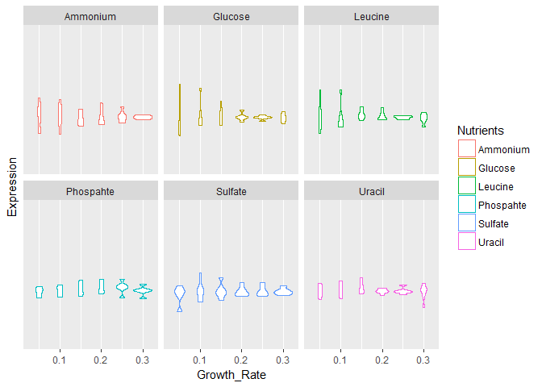
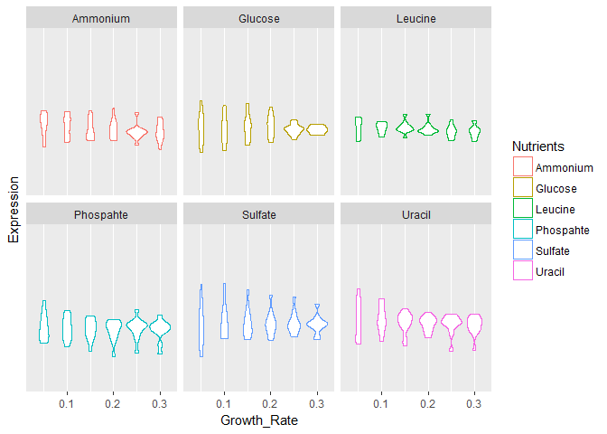
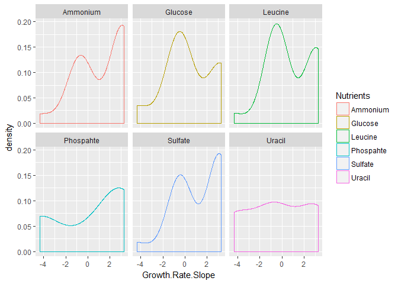
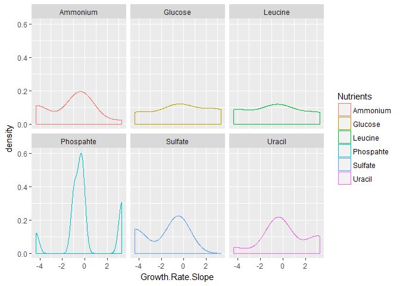
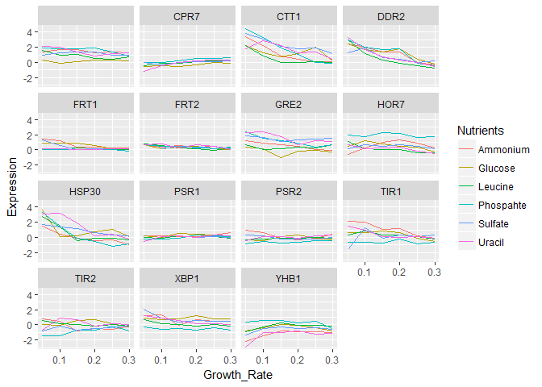

Yeast Growth and Nutrition
================
Yun Mai
March 10, 2017

Show source code in the knitted document

Load packages

``` r
library(RCurl)  
```

    ## Loading required package: bitops

``` r
library(tidyr)
```

    ## 
    ## Attaching package: 'tidyr'

    ## The following object is masked from 'package:RCurl':
    ## 
    ##     complete

``` r
library(dplyr)  
```

    ## Warning: package 'dplyr' was built under R version 3.3.3

    ## 
    ## Attaching package: 'dplyr'

    ## The following objects are masked from 'package:stats':
    ## 
    ##     filter, lag

    ## The following objects are masked from 'package:base':
    ## 
    ##     intersect, setdiff, setequal, union

``` r
library(knitr)
library(ggplot2)
```

    ## Warning: package 'ggplot2' was built under R version 3.3.3

``` r
library(stringr)
```

    ## Warning: package 'stringr' was built under R version 3.3.3

``` r
library(markdown)
```

The correlation between growth rate and cell cycle, stress response, and metabolic activity in yeast.
=====================================================================================================

The changes of gene expressions were measured on RNA level when restricting certain nutrients. Analyzing the gene expression pattern will help to find out how cells respond to the starving and how cells switch gene exprssion program under the restriction of different nutrients.

Import the data
===============

``` r
url <- "https://raw.githubusercontent.com/YunMai-SPS/DA607-homework/master/Prj2_Brauer2008_DataSet1.tds"
yeast <- read.delim(url, header = T, fill = T)
head(yeast)
```

    ##         GID       YORF
    ## 1 GENE1331X A_06_P5820
    ## 2 GENE4924X A_06_P5866
    ## 3 GENE4690X A_06_P1834
    ## 4 GENE1177X A_06_P4928
    ## 5  GENE511X A_06_P5620
    ## 6 GENE2133X A_06_P5307
    ##                                                                                                NAME
    ## 1           SFB2       || ER to Golgi transport || molecular function unknown || YNL049C || 1082129
    ## 2                 || biological process unknown || molecular function unknown || YNL095C || 1086222
    ## 3 QRI7       || proteolysis and peptidolysis || metalloendopeptidase activity || YDL104C || 1085955
    ## 4                        CFT2       || mRNA polyadenylylation* || RNA binding || YLR115W || 1081958
    ## 5                           SSO2       || vesicle fusion* || t-SNARE activity || YMR183C || 1081214
    ## 6      PSP2       || biological process unknown || molecular function unknown || YML017W || 1083036
    ##   GWEIGHT G0.05  G0.1 G0.15  G0.2 G0.25  G0.3 N0.05  N0.1 N0.15  N0.2
    ## 1       1 -0.24 -0.13 -0.21 -0.15 -0.05 -0.05  0.20  0.24 -0.20 -0.42
    ## 2       1  0.28  0.13 -0.40 -0.48 -0.11  0.17  0.31  0.00 -0.63 -0.44
    ## 3       1 -0.02 -0.27 -0.27 -0.02  0.24  0.25  0.23  0.06 -0.66 -0.40
    ## 4       1 -0.33 -0.41 -0.24 -0.03 -0.03  0.00  0.20 -0.25 -0.49 -0.49
    ## 5       1  0.05  0.02  0.40  0.34 -0.13 -0.14 -0.35 -0.09 -0.08 -0.58
    ## 6       1 -0.69 -0.03  0.23  0.20  0.00 -0.27  0.17 -0.40 -0.54 -1.19
    ##   N0.25  N0.3 P0.05  P0.1 P0.15  P0.2 P0.25  P0.3 S0.05  S0.1 S0.15  S0.2
    ## 1 -0.14  0.09 -0.26 -0.20 -0.22 -0.31  0.04  0.34 -0.51 -0.12  0.09  0.09
    ## 2 -0.26  0.21 -0.09 -0.04 -0.10  0.15  0.20  0.63  0.53  0.15 -0.01  0.12
    ## 3 -0.46 -0.43  0.18  0.22  0.33  0.34  0.13  0.44  1.29 -0.32 -0.47 -0.50
    ## 4 -0.43 -0.26  0.05  0.04  0.03 -0.04  0.08  0.21  0.41 -0.43 -0.21 -0.33
    ## 5 -0.14 -0.12 -0.16  0.18  0.21  0.08  0.23 -0.29 -0.70  0.05  0.10 -0.07
    ## 6 -0.42  1.89 -0.32 -0.06 -0.62 -0.50 -0.37    NA    NA -0.20 -0.09  0.06
    ##   S0.25  S0.3 L0.05  L0.1 L0.15  L0.2 L0.25  L0.3 U0.05  U0.1 U0.15  U0.2
    ## 1  0.20  0.08  0.18  0.18  0.13  0.20  0.17  0.11 -0.06 -0.26 -0.05 -0.28
    ## 2 -0.15  0.32  0.16  0.09  0.02  0.04  0.03  0.01 -1.02 -0.91 -0.59 -0.61
    ## 3 -0.42 -0.33 -0.30  0.02 -0.07 -0.05 -0.13 -0.04 -0.91 -0.94 -0.42 -0.36
    ## 4 -0.05 -0.24 -0.27 -0.28 -0.05  0.02  0.00  0.08 -0.53 -0.51 -0.26  0.05
    ## 5 -0.10 -0.32 -0.59 -0.13  0.00 -0.11  0.04  0.01 -0.45 -0.09 -0.13  0.02
    ## 6 -0.19 -0.14 -0.17 -0.07  0.25 -0.21  0.12 -0.11    NA -0.65  0.09  0.06
    ##   U0.25  U0.3
    ## 1 -0.19  0.09
    ## 2 -0.17  0.18
    ## 3 -0.49 -0.47
    ## 4 -0.14 -0.01
    ## 5 -0.09 -0.03
    ## 6 -0.07 -0.10

Tidying the data to the fomat suit to further analysis
======================================================

1.  There are mutiple variables stored in one column. Separate that column into many columns each containing only one variables.

2.  The coulumn "Name"" contains:

<!-- -->

1.  Gene name
2.  According to the paper, Sets of genes were assigned biological process, molecular function, and cellular components based on the categories of annotations from the Gene Ontology (GO) (Ashburner M., et al. (2000) Gene ontology: tool for the unification of biology. The Gene Ontology Consortium. Nat. Genet 25:25-29.). Gene name followed by the decriptions of biological process and molecular function.
3.  Locus tag (according to the gene report in NCBI)
4.  Position

``` r
yeast1 <- yeast %>%
  separate(NAME,c("Name","Biological_Process","Molecular_Function","Locus_tag","Position"),sep = "\\|+") 
```

1.  There are more than one observations in one row. G, N, S, P, U, L are the restricted nutrients which represents glucose, ammonium, sulfate, phosphate, uracil or leucine. The number after these nutrients are dilution rates (and therefore the culture's average exponential growth rate, mu) which range from 0.05 per hour (corresponding to a cell doubling time of about 14 h) to more than 0.3 per hour (doubling time of about 2 h).Each column from G0.05 to the end records the observations for one sample, with two variables in each column header. First I will use gather function to turn the header varriables into a column paried with the coppresponding gene expression values by collaping columns from G0.05 to the end into key-value pairs.

``` r
yeast2 <- gather(yeast1, Sample, Expression, G0.05:ncol(yeast1))
```

1.  There are two variables in column Sample - nutrients and growth rate. Separate this column into two columns.

``` r
yeast3 <- yeast2 %>%
  separate(Sample, c("Nutrients","Growth_Rate"), sep=1, convert = T)
head(yeast3)
```

    ##         GID       YORF        Name             Biological_Process
    ## 1 GENE1331X A_06_P5820 SFB2                ER to Golgi transport 
    ## 2 GENE4924X A_06_P5866                biological process unknown 
    ## 3 GENE4690X A_06_P1834 QRI7         proteolysis and peptidolysis 
    ## 4 GENE1177X A_06_P4928 CFT2              mRNA polyadenylylation* 
    ## 5  GENE511X A_06_P5620 SSO2                      vesicle fusion* 
    ## 6 GENE2133X A_06_P5307 PSP2           biological process unknown 
    ##                Molecular_Function Locus_tag Position GWEIGHT Nutrients
    ## 1     molecular function unknown   YNL049C   1082129       1         G
    ## 2     molecular function unknown   YNL095C   1086222       1         G
    ## 3  metalloendopeptidase activity   YDL104C   1085955       1         G
    ## 4                    RNA binding   YLR115W   1081958       1         G
    ## 5               t-SNARE activity   YMR183C   1081214       1         G
    ## 6     molecular function unknown   YML017W   1083036       1         G
    ##   Growth_Rate Expression
    ## 1        0.05      -0.24
    ## 2        0.05       0.28
    ## 3        0.05      -0.02
    ## 4        0.05      -0.33
    ## 5        0.05       0.05
    ## 6        0.05      -0.69

1.  Replace nutients abbrev to full name since it is more clear to show full name in the figure legends.

``` r
yeast3$Nutrients[yeast3$Nutrients == "G"] <- "Glucose"
yeast3$Nutrients[yeast3$Nutrients == "N"] <- "Ammonium"
yeast3$Nutrients[yeast3$Nutrients == "S"] <- "Sulfate"
yeast3$Nutrients[yeast3$Nutrients == "P"] <- "Phospahte"
yeast3$Nutrients[yeast3$Nutrients == "U"] <- "Uracil"
yeast3$Nutrients[yeast3$Nutrients == "L"] <- "Leucine"
str(yeast3)
```

    ## 'data.frame':    199332 obs. of  11 variables:
    ##  $ GID               : Factor w/ 5537 levels "GENE0X","GENE1000X",..: 369 4360 4100 197 4578 1260 4 4975 1184 1601 ...
    ##  $ YORF              : Factor w/ 5537 levels "A_06_P1002","A_06_P1003",..: 4260 4304 719 3468 4082 3800 4648 5383 1358 4796 ...
    ##  $ Name              : chr  "SFB2       " "          " "QRI7       " "CFT2       " ...
    ##  $ Biological_Process: chr  " ER to Golgi transport " " biological process unknown " " proteolysis and peptidolysis " " mRNA polyadenylylation* " ...
    ##  $ Molecular_Function: chr  " molecular function unknown " " molecular function unknown " " metalloendopeptidase activity " " RNA binding " ...
    ##  $ Locus_tag         : chr  " YNL049C " " YNL095C " " YDL104C " " YLR115W " ...
    ##  $ Position          : chr  " 1082129" " 1086222" " 1085955" " 1081958" ...
    ##  $ GWEIGHT           : int  1 1 1 1 1 1 1 1 1 1 ...
    ##  $ Nutrients         : chr  "Glucose" "Glucose" "Glucose" "Glucose" ...
    ##  $ Growth_Rate       : num  0.05 0.05 0.05 0.05 0.05 0.05 0.05 0.05 0.05 0.05 ...
    ##  $ Expression        : num  -0.24 0.28 -0.02 -0.33 0.05 -0.69 -0.55 -0.75 -0.24 -0.16 ...

Analyze and plot the data
=========================

1.  Filter genes related to cell cycle and take a look at the relation between growth rate and cell-cycle-related gene expression patterns.

``` r
yeast3$Name <- str_trim(yeast3$Name)
yeast3$Biological_Process <- str_trim(yeast3$Biological_Process)
yeast3$Molecular_Function <- str_trim(yeast3$Molecular_Function)
yeast3$Locus_tag <- str_trim(yeast3$Locus_tag)
yeast3$Position <- str_trim(yeast3$Position)

yeast3$GID <- as.vector(yeast3$GID)
yeast3$YORF <- as.vector(yeast3$YORF)

Bio_Pro <- as.factor(yeast3$Biological_Process)
sort(levels(Bio_Pro))
```

    ##   [1] ""                                                                                  
    ##   [2] "'de novo' IMP biosynthesis*"                                                       
    ##   [3] "'de novo' pyrimidine base biosynthesis"                                            
    ##   [4] "'de novo' pyrimidine base biosynthesis*"                                           
    ##   [5] "35S primary transcript processing"                                                 
    ##   [6] "35S primary transcript processing*"                                                
    ##   [7] "acetate biosynthesis"                                                              
    ##   [8] "acetate metabolism"                                                                
    ##   [9] "acetate metabolism*"                                                               
    ##  [10] "acetyl-CoA biosynthesis"                                                           
    ##  [11] "acetyl-CoA biosynthesis from pyruvate"                                             
    ##  [12] "acetyl-CoA biosynthesis*"                                                          
    ##  [13] "actin cortical patch assembly"                                                     
    ##  [14] "actin cytoskeleton organization and biogenesis"                                    
    ##  [15] "actin cytoskeleton organization and biogenesis*"                                   
    ##  [16] "actin filament organization"                                                       
    ##  [17] "actin filament organization*"                                                      
    ##  [18] "adaptation to pheromone during conjugation with cellular fusion"                   
    ##  [19] "adaptation to pheromone during conjugation with cellular fusion*"                  
    ##  [20] "adenine catabolism"                                                                
    ##  [21] "aerobic respiration"                                                               
    ##  [22] "aerobic respiration*"                                                              
    ##  [23] "agglutination during conjugation with cellular fusion"                             
    ##  [24] "alanyl-tRNA aminoacylation"                                                        
    ##  [25] "alcohol metabolism"                                                                
    ##  [26] "alcohol metabolism*"                                                               
    ##  [27] "aldehyde metabolism"                                                               
    ##  [28] "aldehyde metabolism*"                                                              
    ##  [29] "allantoate transport"                                                              
    ##  [30] "allantoin catabolism"                                                              
    ##  [31] "allantoin catabolism*"                                                             
    ##  [32] "allantoin transport"                                                               
    ##  [33] "alpha-glucoside transport"                                                         
    ##  [34] "alpha-glucoside transport*"                                                        
    ##  [35] "amino acid derivative catabolism"                                                  
    ##  [36] "amino acid metabolism"                                                             
    ##  [37] "amino acid transport"                                                              
    ##  [38] "amino acid transport*"                                                             
    ##  [39] "ammonium transport"                                                                
    ##  [40] "AMP biosynthesis*"                                                                 
    ##  [41] "anaerobic respiration"                                                             
    ##  [42] "apoptosis"                                                                         
    ##  [43] "arabinose catabolism*"                                                             
    ##  [44] "arginine biosynthesis"                                                             
    ##  [45] "arginine biosynthesis*"                                                            
    ##  [46] "arginine catabolism"                                                               
    ##  [47] "arginine catabolism to ornithine"                                                  
    ##  [48] "arginine metabolism*"                                                              
    ##  [49] "aromatic amino acid family biosynthesis"                                           
    ##  [50] "aromatic amino acid family metabolism"                                             
    ##  [51] "aromatic amino acid transport"                                                     
    ##  [52] "aromatic compound catabolism"                                                      
    ##  [53] "asparagine biosynthesis"                                                           
    ##  [54] "asparagine catabolism"                                                             
    ##  [55] "asparagine catabolism*"                                                            
    ##  [56] "asparaginyl-tRNA aminoacylation"                                                   
    ##  [57] "aspartate biosynthesis*"                                                           
    ##  [58] "ATP synthesis coupled proton transport"                                            
    ##  [59] "ATP synthesis coupled proton transport*"                                           
    ##  [60] "attachment of GPI anchor to protein"                                               
    ##  [61] "attachment of spindle microtubules to kinetochore"                                 
    ##  [62] "autophagy"                                                                         
    ##  [63] "autophagy*"                                                                        
    ##  [64] "axial bud site selection"                                                          
    ##  [65] "barbed-end actin filament capping"                                                 
    ##  [66] "base-excision repair*"                                                             
    ##  [67] "basic amino acid transport"                                                        
    ##  [68] "beta-1,6 glucan biosynthesis"                                                      
    ##  [69] "beta-tubulin folding*"                                                             
    ##  [70] "bile acid transport"                                                               
    ##  [71] "bilirubin transport*"                                                              
    ##  [72] "biological process unknown"                                                        
    ##  [73] "biological process unknown*"                                                       
    ##  [74] "biotin biosynthesis"                                                               
    ##  [75] "biotin biosynthesis*"                                                              
    ##  [76] "biotin transport"                                                                  
    ##  [77] "bipolar bud site selection*"                                                       
    ##  [78] "branched chain family amino acid biosynthesis"                                     
    ##  [79] "branched chain family amino acid biosynthesis*"                                    
    ##  [80] "bud site selection"                                                                
    ##  [81] "bud site selection*"                                                               
    ##  [82] "budding cell bud growth"                                                           
    ##  [83] "budding cell bud growth*"                                                          
    ##  [84] "butanediol fermentation"                                                           
    ##  [85] "C-terminal protein amino acid methylation"                                         
    ##  [86] "calcium-mediated signaling"                                                        
    ##  [87] "calcium ion homeostasis*"                                                          
    ##  [88] "calcium ion transport"                                                             
    ##  [89] "cAMP-mediated signaling"                                                           
    ##  [90] "carbohydrate metabolism"                                                           
    ##  [91] "carbohydrate metabolism*"                                                          
    ##  [92] "carbohydrate transport"                                                            
    ##  [93] "carbon utilization"                                                                
    ##  [94] "carnitine metabolism"                                                              
    ##  [95] "cation homeostasis"                                                                
    ##  [96] "cation transport"                                                                  
    ##  [97] "cell cycle"                                                                        
    ##  [98] "cell cycle arrest in response to pheromone"                                        
    ##  [99] "cell cycle*"                                                                       
    ## [100] "cell growth"                                                                       
    ## [101] "cell ion homeostasis"                                                              
    ## [102] "cell ion homeostasis*"                                                             
    ## [103] "cell surface receptor linked signal transduction"                                  
    ## [104] "cell wall biosynthesis (sensu Fungi)"                                              
    ## [105] "cell wall chitin biosynthesis"                                                     
    ## [106] "cell wall chitin biosynthesis*"                                                    
    ## [107] "cell wall mannoprotein biosynthesis"                                               
    ## [108] "cell wall mannoprotein biosynthesis*"                                              
    ## [109] "cell wall organization and biogenesis"                                             
    ## [110] "cell wall organization and biogenesis*"                                            
    ## [111] "cellular morphogenesis"                                                            
    ## [112] "cellular morphogenesis during conjugation with cellular fusion"                    
    ## [113] "cellular morphogenesis during conjugation with cellular fusion*"                   
    ## [114] "cellular morphogenesis during vegetative growth"                                   
    ## [115] "cellular morphogenesis*"                                                           
    ## [116] "cellular respiration"                                                              
    ## [117] "cellular response to glucose starvation"                                           
    ## [118] "ceramide biosynthesis"                                                             
    ## [119] "ceramide biosynthesis*"                                                            
    ## [120] "ceramide metabolism"                                                               
    ## [121] "charged-tRNA modification"                                                         
    ## [122] "chitin biosynthesis*"                                                              
    ## [123] "choline transport"                                                                 
    ## [124] "chromatin assembly or disassembly"                                                 
    ## [125] "chromatin assembly or disassembly*"                                                
    ## [126] "chromatin modification"                                                            
    ## [127] "chromatin remodeling"                                                              
    ## [128] "chromatin remodeling*"                                                             
    ## [129] "chromatin silencing"                                                               
    ## [130] "chromatin silencing at ribosomal DNA*"                                             
    ## [131] "chromatin silencing at silent mating-type cassette"                                
    ## [132] "chromatin silencing at silent mating-type cassette*"                               
    ## [133] "chromatin silencing at telomere"                                                   
    ## [134] "chromatin silencing at telomere*"                                                  
    ## [135] "chromatin silencing*"                                                              
    ## [136] "chromosome organization and biogenesis (sensu Eukaryota)"                          
    ## [137] "chromosome segregation"                                                            
    ## [138] "chromosome segregation*"                                                           
    ## [139] "cis assembly of U2-type pre-catalytic spliceosome"                                 
    ## [140] "coenzyme A biosynthesis"                                                           
    ## [141] "coenzyme A transport"                                                              
    ## [142] "conjugation with cellular fusion"                                                  
    ## [143] "conjugation with cellular fusion*"                                                 
    ## [144] "copper ion homeostasis*"                                                           
    ## [145] "copper ion import"                                                                 
    ## [146] "copper ion transport"                                                              
    ## [147] "cotranslational protein-membrane targeting"                                        
    ## [148] "cysteine biosynthesis"                                                             
    ## [149] "cysteine metabolism*"                                                              
    ## [150] "cytidine catabolism*"                                                              
    ## [151] "cytochrome c-heme linkage"                                                         
    ## [152] "cytochrome c oxidase complex assembly"                                             
    ## [153] "cytochrome c oxidase complex assembly*"                                            
    ## [154] "cytokinesis"                                                                       
    ## [155] "cytokinesis*"                                                                      
    ## [156] "cytokinesis, completion of separation"                                             
    ## [157] "cytokinesis, completion of separation*"                                            
    ## [158] "cytokinesis, contractile ring contraction"                                         
    ## [159] "cytoskeleton organization and biogenesis"                                          
    ## [160] "cytoskeleton organization and biogenesis*"                                         
    ## [161] "D-ribose metabolism"                                                               
    ## [162] "deadenylylation-dependent decapping"                                               
    ## [163] "deadenylylation-dependent decapping*"                                              
    ## [164] "deadenylylation-independent decapping"                                             
    ## [165] "diadenosine polyphosphate metabolism"                                              
    ## [166] "dicarboxylic acid transport"                                                       
    ## [167] "DNA-dependent DNA replication"                                                     
    ## [168] "DNA-dependent DNA replication*"                                                    
    ## [169] "DNA damage checkpoint*"                                                            
    ## [170] "DNA damage response, signal transduction resulting in induction of apoptosis"      
    ## [171] "DNA dealkylation"                                                                  
    ## [172] "DNA metabolism"                                                                    
    ## [173] "DNA recombination"                                                                 
    ## [174] "DNA recombination*"                                                                
    ## [175] "DNA repair"                                                                        
    ## [176] "DNA repair*"                                                                       
    ## [177] "DNA replication"                                                                   
    ## [178] "DNA replication initiation*"                                                       
    ## [179] "DNA replication*"                                                                  
    ## [180] "DNA strand elongation"                                                             
    ## [181] "DNA topological change"                                                            
    ## [182] "dolichol-linked oligosaccharide biosynthesis"                                      
    ## [183] "double-strand break repair"                                                        
    ## [184] "double-strand break repair via nonhomologous end-joining"                          
    ## [185] "double-strand break repair via nonhomologous end-joining*"                         
    ## [186] "double-strand break repair*"                                                       
    ## [187] "drug transport*"                                                                   
    ## [188] "electron transport"                                                                
    ## [189] "electron transport*"                                                               
    ## [190] "endocytosis"                                                                       
    ## [191] "endocytosis*"                                                                      
    ## [192] "ER-associated protein catabolism"                                                  
    ## [193] "ER-associated protein catabolism*"                                                 
    ## [194] "ER organization and biogenesis"                                                    
    ## [195] "ER to Golgi transport"                                                             
    ## [196] "ER to Golgi transport*"                                                            
    ## [197] "ergosterol biosynthesis"                                                           
    ## [198] "ergosterol biosynthesis*"                                                          
    ## [199] "error-free DNA repair"                                                             
    ## [200] "establishment and/or maintenance of chromatin architecture"                        
    ## [201] "establishment of cell polarity (sensu Fungi)"                                      
    ## [202] "establishment of cell polarity (sensu Fungi)*"                                     
    ## [203] "establishment of mitotic spindle orientation"                                      
    ## [204] "establishment of mitotic spindle orientation*"                                     
    ## [205] "ethanol fermentation*"                                                             
    ## [206] "ethanol metabolism"                                                                
    ## [207] "exocytosis"                                                                        
    ## [208] "exocytosis*"                                                                       
    ## [209] "FAD biosynthesis"                                                                  
    ## [210] "FAD transport"                                                                     
    ## [211] "fatty acid beta-oxidation"                                                         
    ## [212] "fatty acid beta-oxidation*"                                                        
    ## [213] "fatty acid biosynthesis"                                                           
    ## [214] "fatty acid biosynthesis*"                                                          
    ## [215] "fatty acid elongation"                                                             
    ## [216] "fatty acid elongation, unsaturated fatty acid"                                     
    ## [217] "fatty acid metabolism"                                                             
    ## [218] "fatty acid metabolism*"                                                            
    ## [219] "fatty acid oxidation"                                                              
    ## [220] "fatty acid transport"                                                              
    ## [221] "fermentation"                                                                      
    ## [222] "fermentation*"                                                                     
    ## [223] "ferric-enterobactin transport"                                                     
    ## [224] "filamentous growth*"                                                               
    ## [225] "flocculation (sensu Saccharomyces)"                                                
    ## [226] "FMN biosynthesis"                                                                  
    ## [227] "folic acid and derivative biosynthesis"                                            
    ## [228] "folic acid and derivative metabolism"                                              
    ## [229] "formaldehyde catabolism"                                                           
    ## [230] "formation of catalytic U2-type spliceosome for second transesterification step"    
    ## [231] "fructose 2,6-bisphosphate metabolism*"                                             
    ## [232] "fumarate transport*"                                                               
    ## [233] "G-protein signaling, coupled to cAMP nucleotide second messenger"                  
    ## [234] "G1-specific transcription in mitotic cell cycle"                                   
    ## [235] "G1/S-specific transcription in mitotic cell cycle"                                 
    ## [236] "G1/S-specific transcription in mitotic cell cycle*"                                
    ## [237] "G1/S transition of mitotic cell cycle"                                             
    ## [238] "G1/S transition of mitotic cell cycle*"                                            
    ## [239] "G2/M-specific transcription in mitotic cell cycle"                                 
    ## [240] "G2/M transition of mitotic cell cycle*"                                            
    ## [241] "galactose metabolism"                                                              
    ## [242] "gluconeogenesis"                                                                   
    ## [243] "gluconeogenesis*"                                                                  
    ## [244] "glucose 1-phosphate utilization*"                                                  
    ## [245] "glucose metabolism"                                                                
    ## [246] "glucose metabolism*"                                                               
    ## [247] "glutamate biosynthesis"                                                            
    ## [248] "glutamate biosynthesis*"                                                           
    ## [249] "glutaminyl-tRNA aminoacylation"                                                    
    ## [250] "glutamyl-tRNA aminoacylation"                                                      
    ## [251] "glutathione biosynthesis"                                                          
    ## [252] "glutathione catabolism"                                                            
    ## [253] "glutathione metabolism"                                                            
    ## [254] "glutathione metabolism*"                                                           
    ## [255] "glycerol metabolism"                                                               
    ## [256] "glycerol transport"                                                                
    ## [257] "glycerol transport*"                                                               
    ## [258] "glycerophosphodiester transport"                                                   
    ## [259] "glycerophospholipid metabolism"                                                    
    ## [260] "glycine biosynthesis"                                                              
    ## [261] "glycine catabolism*"                                                               
    ## [262] "glycogen biosynthesis"                                                             
    ## [263] "glycogen catabolism"                                                               
    ## [264] "glycogen metabolism"                                                               
    ## [265] "glycolysis"                                                                        
    ## [266] "glycolysis*"                                                                       
    ## [267] "glycyl-tRNA aminoacylation"                                                        
    ## [268] "glycyl-tRNA aminoacylation*"                                                       
    ## [269] "glyoxylate cycle"                                                                  
    ## [270] "GMP metabolism"                                                                    
    ## [271] "Golgi organization and biogenesis"                                                 
    ## [272] "Golgi to endosome transport"                                                       
    ## [273] "Golgi to endosome transport*"                                                      
    ## [274] "Golgi to plasma membrane transport*"                                               
    ## [275] "Golgi to vacuole transport"                                                        
    ## [276] "Golgi to vacuole transport*"                                                       
    ## [277] "Golgi vesicle transport"                                                           
    ## [278] "GPI anchor biosynthesis"                                                           
    ## [279] "GPI anchor biosynthesis*"                                                          
    ## [280] "Group I intron splicing"                                                           
    ## [281] "Group I intron splicing*"                                                          
    ## [282] "GTP biosynthesis"                                                                  
    ## [283] "guanine metabolism"                                                                
    ## [284] "heme a biosynthesis"                                                               
    ## [285] "heme biosynthesis"                                                                 
    ## [286] "hexose transport"                                                                  
    ## [287] "high-affinity zinc ion transport"                                                  
    ## [288] "high affinity iron ion transport"                                                  
    ## [289] "high affinity iron ion transport*"                                                 
    ## [290] "histidine biosynthesis"                                                            
    ## [291] "histidine biosynthesis*"                                                           
    ## [292] "histidyl-tRNA aminoacylation"                                                      
    ## [293] "histone acetylation"                                                               
    ## [294] "histone acetylation*"                                                              
    ## [295] "histone deacetylation"                                                             
    ## [296] "histone deacetylation*"                                                            
    ## [297] "histone methylation"                                                               
    ## [298] "histone methylation*"                                                              
    ## [299] "hypusine biosynthesis from peptidyl-lysine"                                        
    ## [300] "inner mitochondrial membrane organization and biogenesis"                          
    ## [301] "inosine salvage"                                                                   
    ## [302] "inositol phosphate dephosphorylation"                                              
    ## [303] "intra-Golgi transport"                                                             
    ## [304] "intra-Golgi transport*"                                                            
    ## [305] "intracellular accumulation of glycerol"                                            
    ## [306] "intracellular copper ion transport"                                                
    ## [307] "intracellular copper ion transport*"                                               
    ## [308] "intracellular mRNA localization"                                                   
    ## [309] "intracellular mRNA localization*"                                                  
    ## [310] "intracellular protein transport"                                                   
    ## [311] "intracellular protein transport*"                                                  
    ## [312] "intracellular sequestering of iron ion"                                            
    ## [313] "intracellular signaling cascade"                                                   
    ## [314] "intracellular signaling cascade*"                                                  
    ## [315] "intron homing"                                                                     
    ## [316] "invasive growth (sensu Saccharomyces)"                                             
    ## [317] "invasive growth (sensu Saccharomyces)*"                                            
    ## [318] "ion transport"                                                                     
    ## [319] "iron-siderophore transport"                                                        
    ## [320] "iron-sulfur cluster assembly"                                                      
    ## [321] "iron ion homeostasis"                                                              
    ## [322] "iron ion homeostasis*"                                                             
    ## [323] "iron ion transport"                                                                
    ## [324] "iron ion transport*"                                                               
    ## [325] "karyogamy"                                                                         
    ## [326] "karyogamy during conjugation with cellular fusion"                                 
    ## [327] "L-arginine transport*"                                                             
    ## [328] "L-aspartate transport*"                                                            
    ## [329] "L-cystine transport"                                                               
    ## [330] "lactate metabolism"                                                                
    ## [331] "lactate transport"                                                                 
    ## [332] "lagging strand elongation"                                                         
    ## [333] "late endosome to vacuole transport"                                                
    ## [334] "late endosome to vacuole transport*"                                               
    ## [335] "leucine biosynthesis"                                                              
    ## [336] "leucyl-tRNA aminoacylation"                                                        
    ## [337] "lipid metabolism"                                                                  
    ## [338] "lipid metabolism*"                                                                 
    ## [339] "lipid transport*"                                                                  
    ## [340] "lipoic acid biosynthesis"                                                          
    ## [341] "loss of chromatin silencing"                                                       
    ## [342] "low-affinity zinc ion transport"                                                   
    ## [343] "lysine biosynthesis"                                                               
    ## [344] "lysine biosynthesis via aminoadipic acid"                                          
    ## [345] "lysine biosynthesis via aminoadipic acid*"                                         
    ## [346] "lysyl-tRNA aminoacylation"                                                         
    ## [347] "magnesium ion transport"                                                           
    ## [348] "magnesium ion transport*"                                                          
    ## [349] "maintenance of cell polarity (sensu Fungi)"                                        
    ## [350] "maltose catabolism"                                                                
    ## [351] "manganese ion homeostasis"                                                         
    ## [352] "manganese ion transport"                                                           
    ## [353] "manganese ion transport*"                                                          
    ## [354] "MAPKKK cascade"                                                                    
    ## [355] "MAPKKK cascade during cell wall biogenesis"                                        
    ## [356] "mating type switching*"                                                            
    ## [357] "meiosis"                                                                           
    ## [358] "meiosis*"                                                                          
    ## [359] "meiotic chromosome segregation*"                                                   
    ## [360] "meiotic DNA double-strand break formation"                                         
    ## [361] "meiotic DNA recombinase assembly*"                                                 
    ## [362] "meiotic recombination"                                                             
    ## [363] "meiotic recombination*"                                                            
    ## [364] "membrane organization and biogenesis"                                              
    ## [365] "metabolism"                                                                        
    ## [366] "methionine biosynthesis"                                                           
    ## [367] "methionine biosynthesis*"                                                          
    ## [368] "methionine metabolism"                                                             
    ## [369] "methionine metabolism*"                                                            
    ## [370] "methionine salvage"                                                                
    ## [371] "methionyl-tRNA aminoacylation"                                                     
    ## [372] "microautophagy"                                                                    
    ## [373] "microtubule-based process"                                                         
    ## [374] "microtubule-based process*"                                                        
    ## [375] "microtubule cytoskeleton organization and biogenesis"                              
    ## [376] "microtubule cytoskeleton organization and biogenesis*"                             
    ## [377] "microtubule nucleation"                                                            
    ## [378] "microtubule nucleation*"                                                           
    ## [379] "misfolded or incompletely synthesized protein catabolism"                          
    ## [380] "misfolded or incompletely synthesized protein catabolism*"                         
    ## [381] "mismatch repair"                                                                   
    ## [382] "mismatch repair*"                                                                  
    ## [383] "mitochondrial citrate transport"                                                   
    ## [384] "mitochondrial electron transport, cytochrome c to oxygen*"                         
    ## [385] "mitochondrial electron transport, NADH to ubiquinone"                              
    ## [386] "mitochondrial electron transport, ubiquinol to cytochrome c*"                      
    ## [387] "mitochondrial fission"                                                             
    ## [388] "mitochondrial genome maintenance"                                                  
    ## [389] "mitochondrial genome maintenance*"                                                 
    ## [390] "mitochondrial inner membrane protein import"                                       
    ## [391] "mitochondrial intermembrane space protein import"                                  
    ## [392] "mitochondrial intermembrane space protein import*"                                 
    ## [393] "mitochondrial magnesium ion transport"                                             
    ## [394] "mitochondrial magnesium ion transport*"                                            
    ## [395] "mitochondrial matrix protein import"                                               
    ## [396] "mitochondrial matrix protein import*"                                              
    ## [397] "mitochondrial membrane organization and biogenesis*"                               
    ## [398] "mitochondrial outer membrane protein import"                                       
    ## [399] "mitochondrial protein processing"                                                  
    ## [400] "mitochondrial transport"                                                           
    ## [401] "mitochondrion inheritance"                                                         
    ## [402] "mitochondrion inheritance*"                                                        
    ## [403] "mitochondrion organization and biogenesis"                                         
    ## [404] "mitochondrion organization and biogenesis*"                                        
    ## [405] "mitosis"                                                                           
    ## [406] "mitotic sister chromatid cohesion"                                                 
    ## [407] "mitotic sister chromatid cohesion*"                                                
    ## [408] "mitotic sister chromatid segregation"                                              
    ## [409] "mitotic sister chromatid segregation*"                                             
    ## [410] "mitotic spindle checkpoint"                                                        
    ## [411] "mitotic spindle checkpoint*"                                                       
    ## [412] "mitotic spindle organization and biogenesis in nucleus*"                           
    ## [413] "monosaccharide metabolism"                                                         
    ## [414] "monovalent inorganic cation homeostasis"                                           
    ## [415] "monovalent inorganic cation transport"                                             
    ## [416] "movement of group I intron"                                                        
    ## [417] "mRNA-nucleus export"                                                               
    ## [418] "mRNA-nucleus export*"                                                              
    ## [419] "mRNA capping"                                                                      
    ## [420] "mRNA catabolism*"                                                                  
    ## [421] "mRNA catabolism, deadenylylation-dependent decay"                                  
    ## [422] "mRNA catabolism, deadenylylation-dependent decay*"                                 
    ## [423] "mRNA catabolism, nonsense-mediated decay"                                          
    ## [424] "mRNA metabolism"                                                                   
    ## [425] "mRNA polyadenylylation"                                                            
    ## [426] "mRNA polyadenylylation*"                                                           
    ## [427] "mRNA processing"                                                                   
    ## [428] "mRNA processing*"                                                                  
    ## [429] "mRNA splice site selection"                                                        
    ## [430] "multidrug transport"                                                               
    ## [431] "myo-inositol metabolism"                                                           
    ## [432] "myo-inositol transport"                                                            
    ## [433] "N-acetylglucosamine biosynthesis"                                                  
    ## [434] "N-terminal peptidyl-glycine N-myristoylation"                                      
    ## [435] "N-terminal peptidyl-methionine acetylation"                                        
    ## [436] "N-terminal protein amino acid acetylation"                                         
    ## [437] "NAD biosynthesis"                                                                  
    ## [438] "NAD catabolism"                                                                    
    ## [439] "NAD metabolism"                                                                    
    ## [440] "NADH metabolism"                                                                   
    ## [441] "nascent polypeptide association"                                                   
    ## [442] "negative regulation of DNA transposition"                                          
    ## [443] "negative regulation of exit from mitosis*"                                         
    ## [444] "negative regulation of gluconeogenesis"                                            
    ## [445] "negative regulation of sporulation"                                                
    ## [446] "negative regulation of transcription from RNA polymerase II promoter"              
    ## [447] "negative regulation of transcription from RNA polymerase II promoter*"             
    ## [448] "negative regulation of transcription from RNA polymerase III promoter"             
    ## [449] "negative regulation of transcription*"                                             
    ## [450] "negative regulation of translation"                                                
    ## [451] "neutral amino acid transport"                                                      
    ## [452] "nicotinamide mononucleotide transport"                                             
    ## [453] "nicotinamide riboside metabolism"                                                  
    ## [454] "nitrogen compound metabolism"                                                      
    ## [455] "nitrogen compound metabolism*"                                                     
    ## [456] "nitrogen utilization"                                                              
    ## [457] "not yet annotated"                                                                 
    ## [458] "nuclear migration"                                                                 
    ## [459] "nuclear migration, microtubule-mediated"                                           
    ## [460] "nuclear migration, microtubule-mediated*"                                          
    ## [461] "nuclear mRNA splicing, via spliceosome"                                            
    ## [462] "nuclear mRNA splicing, via spliceosome*"                                           
    ## [463] "nuclear organization and biogenesis"                                               
    ## [464] "nuclear pore organization and biogenesis"                                          
    ## [465] "nucleobase, nucleoside, nucleotide and nucleic acid metabolism"                    
    ## [466] "nucleobase, nucleoside, nucleotide and nucleic acid metabolism*"                   
    ## [467] "nucleocytoplasmic transport"                                                       
    ## [468] "nucleocytoplasmic transport*"                                                      
    ## [469] "nucleoside catabolism"                                                             
    ## [470] "nucleoside transport"                                                              
    ## [471] "nucleosome assembly"                                                               
    ## [472] "nucleotide-excision repair*"                                                       
    ## [473] "nucleotide-excision repair, DNA damage recognition"                                
    ## [474] "nucleotide-excision repair, DNA incision, 3'-to lesion"                            
    ## [475] "nucleotide-sugar transport"                                                        
    ## [476] "nucleotide metabolism"                                                             
    ## [477] "nucleotide metabolism*"                                                            
    ## [478] "oligopeptide transport"                                                            
    ## [479] "oligosaccharide-lipid intermediate assembly"                                       
    ## [480] "one-carbon compound metabolism"                                                    
    ## [481] "one-carbon compound metabolism*"                                                   
    ## [482] "osmoregulation"                                                                    
    ## [483] "osmosensory signaling pathway"                                                     
    ## [484] "osmosensory signaling pathway via two-component system*"                           
    ## [485] "outer mitochondrial membrane organization and biogenesis"                          
    ## [486] "oxidative phosphorylation"                                                         
    ## [487] "oxygen and reactive oxygen species metabolism"                                     
    ## [488] "pantothenate biosynthesis"                                                         
    ## [489] "pantothenate biosynthesis*"                                                        
    ## [490] "para-aminobenzoic acid metabolism"                                                 
    ## [491] "pentose-phosphate shunt"                                                           
    ## [492] "peptide metabolism"                                                                
    ## [493] "peptide pheromone export"                                                          
    ## [494] "peptide pheromone maturation"                                                      
    ## [495] "peptide pheromone maturation*"                                                     
    ## [496] "peptide transport"                                                                 
    ## [497] "peptidyl-arginine methylation"                                                     
    ## [498] "peptidyl-diphthamide biosynthesis from peptidyl-histidine"                         
    ## [499] "peptidyl-diphthamide biosynthesis from peptidyl-histidine*"                        
    ## [500] "peptidyl-glutamine methylation"                                                    
    ## [501] "peroxisome inheritance"                                                            
    ## [502] "peroxisome matrix protein import"                                                  
    ## [503] "peroxisome organization and biogenesis"                                            
    ## [504] "peroxisome organization and biogenesis*"                                           
    ## [505] "phenylalanine biosynthesis, prephenate pathway"                                    
    ## [506] "phenylalanyl-tRNA aminoacylation"                                                  
    ## [507] "phosphate metabolism"                                                              
    ## [508] "phosphate metabolism*"                                                             
    ## [509] "phosphate transport"                                                               
    ## [510] "phosphatidic acid biosynthesis"                                                    
    ## [511] "phosphatidylcholine biosynthesis"                                                  
    ## [512] "phosphatidylcholine biosynthesis*"                                                 
    ## [513] "phosphatidylcholine metabolism"                                                    
    ## [514] "phosphatidylethanolamine biosynthesis"                                             
    ## [515] "phosphatidylglycerol biosynthesis*"                                                
    ## [516] "phosphatidylserine biosynthesis"                                                   
    ## [517] "phosphatidylserine catabolism*"                                                    
    ## [518] "phospholipid biosynthesis"                                                         
    ## [519] "phospholipid biosynthesis*"                                                        
    ## [520] "phospholipid metabolism"                                                           
    ## [521] "phospholipid transport"                                                            
    ## [522] "photoreactive repair"                                                              
    ## [523] "plasmid maintenance"                                                               
    ## [524] "poly(A)+ mRNA-nucleus export"                                                      
    ## [525] "polyamine transport"                                                               
    ## [526] "polyphosphate metabolism"                                                          
    ## [527] "positive regulation of transcription"                                              
    ## [528] "positive regulation of transcription from RNA polymerase II promoter"              
    ## [529] "positive regulation of transcription from RNA polymerase II promoter by pheromones"
    ## [530] "positive regulation of transcription from RNA polymerase II promoter*"             
    ## [531] "post-chaperonin tubulin folding pathway*"                                          
    ## [532] "postreplication repair*"                                                           
    ## [533] "posttranslational protein-membrane targeting"                                      
    ## [534] "posttranslational protein-membrane targeting*"                                     
    ## [535] "potassium ion homeostasis"                                                         
    ## [536] "pre-replicative complex formation and maintenance"                                 
    ## [537] "premeiotic DNA synthesis"                                                          
    ## [538] "processing of 20S pre-rRNA"                                                        
    ## [539] "processing of 20S pre-rRNA*"                                                       
    ## [540] "processing of 27S pre-rRNA"                                                        
    ## [541] "processing of 27S pre-rRNA*"                                                       
    ## [542] "proline biosynthesis"                                                              
    ## [543] "proline catabolism*"                                                               
    ## [544] "propionate metabolism"                                                             
    ## [545] "propionate metabolism*"                                                            
    ## [546] "protein-cofactor linkage"                                                          
    ## [547] "protein-ER targeting"                                                              
    ## [548] "protein-ER targeting*"                                                             
    ## [549] "protein-lipoylation"                                                               
    ## [550] "protein-membrane targeting"                                                        
    ## [551] "protein-membrane targeting*"                                                       
    ## [552] "protein-mitochondrial targeting"                                                   
    ## [553] "protein-mitochondrial targeting*"                                                  
    ## [554] "protein-nucleus export"                                                            
    ## [555] "protein-nucleus export*"                                                           
    ## [556] "protein-nucleus import"                                                            
    ## [557] "protein-nucleus import*"                                                           
    ## [558] "protein-peroxisome targeting"                                                      
    ## [559] "protein-peroxisome targeting*"                                                     
    ## [560] "protein-vacuolar targeting"                                                        
    ## [561] "protein-vacuolar targeting*"                                                       
    ## [562] "protein amino acid acetylation"                                                    
    ## [563] "protein amino acid biotinylation"                                                  
    ## [564] "protein amino acid dephosphorylation"                                              
    ## [565] "protein amino acid dephosphorylation*"                                             
    ## [566] "protein amino acid farnesylation"                                                  
    ## [567] "protein amino acid geranylgeranylation"                                            
    ## [568] "protein amino acid glycosylation"                                                  
    ## [569] "protein amino acid glycosylation*"                                                 
    ## [570] "protein amino acid N-linked glycosylation"                                         
    ## [571] "protein amino acid N-linked glycosylation*"                                        
    ## [572] "protein amino acid O-linked glycosylation"                                         
    ## [573] "protein amino acid O-linked glycosylation*"                                        
    ## [574] "protein amino acid phosphorylation"                                                
    ## [575] "protein amino acid phosphorylation*"                                               
    ## [576] "protein biosynthesis"                                                              
    ## [577] "protein biosynthesis*"                                                             
    ## [578] "protein catabolism"                                                                
    ## [579] "protein catabolism*"                                                               
    ## [580] "protein complex assembly"                                                          
    ## [581] "protein complex assembly*"                                                         
    ## [582] "protein deneddylation"                                                             
    ## [583] "protein deneddylation*"                                                            
    ## [584] "protein deubiquitination"                                                          
    ## [585] "protein deubiquitination*"                                                         
    ## [586] "protein folding"                                                                   
    ## [587] "protein folding*"                                                                  
    ## [588] "protein localization"                                                              
    ## [589] "protein metabolism"                                                                
    ## [590] "protein modification"                                                              
    ## [591] "protein modification*"                                                             
    ## [592] "protein monoubiquitination"                                                        
    ## [593] "protein monoubiquitination*"                                                       
    ## [594] "protein neddylation"                                                               
    ## [595] "protein neddylation*"                                                              
    ## [596] "protein processing"                                                                
    ## [597] "protein processing*"                                                               
    ## [598] "protein retention in ER"                                                           
    ## [599] "protein retention in Golgi*"                                                       
    ## [600] "protein secretion"                                                                 
    ## [601] "protein secretion*"                                                                
    ## [602] "protein sumoylation"                                                               
    ## [603] "protein sumoylation*"                                                              
    ## [604] "protein targeting*"                                                                
    ## [605] "protein thiol-disulfide exchange"                                                  
    ## [606] "protein transport"                                                                 
    ## [607] "protein ubiquitination"                                                            
    ## [608] "protein ubiquitination*"                                                           
    ## [609] "proteolysis and peptidolysis"                                                      
    ## [610] "proteolysis and peptidolysis*"                                                     
    ## [611] "proton transport"                                                                  
    ## [612] "pseudohyphal growth"                                                               
    ## [613] "pseudohyphal growth*"                                                              
    ## [614] "purine base biosynthesis*"                                                         
    ## [615] "purine base metabolism"                                                            
    ## [616] "purine nucleoside catabolism"                                                      
    ## [617] "purine nucleotide biosynthesis"                                                    
    ## [618] "purine nucleotide biosynthesis*"                                                   
    ## [619] "purine nucleotide metabolism"                                                      
    ## [620] "purine transport*"                                                                 
    ## [621] "pyridoxine metabolism"                                                             
    ## [622] "pyridoxine metabolism*"                                                            
    ## [623] "pyrimidine base metabolism"                                                        
    ## [624] "pyrimidine deoxyribonucleoside triphosphate catabolism"                            
    ## [625] "pyrimidine nucleotide metabolism"                                                  
    ## [626] "pyrimidine salvage"                                                                
    ## [627] "pyrimidine salvage*"                                                               
    ## [628] "pyruvate metabolism"                                                               
    ## [629] "pyruvate metabolism*"                                                              
    ## [630] "Ras protein signal transduction"                                                   
    ## [631] "Ras protein signal transduction*"                                                  
    ## [632] "regulation of amino acid metabolism"                                               
    ## [633] "regulation of cell budding"                                                        
    ## [634] "regulation of cell growth"                                                         
    ## [635] "regulation of cell redox homeostasis"                                              
    ## [636] "regulation of cell redox homeostasis*"                                             
    ## [637] "regulation of cell size"                                                           
    ## [638] "regulation of cyclin dependent protein kinase activity"                            
    ## [639] "regulation of cyclin dependent protein kinase activity*"                           
    ## [640] "regulation of DNA replication"                                                     
    ## [641] "regulation of DNA replication initiation"                                          
    ## [642] "regulation of exit from mitosis"                                                   
    ## [643] "regulation of exit from mitosis*"                                                  
    ## [644] "regulation of glycogen biosynthesis"                                               
    ## [645] "regulation of glycogen biosynthesis*"                                              
    ## [646] "regulation of meiosis"                                                             
    ## [647] "regulation of mitosis"                                                             
    ## [648] "regulation of nitrogen utilization"                                                
    ## [649] "regulation of nitrogen utilization*"                                               
    ## [650] "regulation of pH*"                                                                 
    ## [651] "regulation of phosphate metabolism"                                                
    ## [652] "regulation of progression through cell cycle"                                      
    ## [653] "regulation of progression through cell cycle*"                                     
    ## [654] "regulation of progression through mitotic cell cycle"                              
    ## [655] "regulation of protein biosynthesis"                                                
    ## [656] "regulation of proteolysis and peptidolysis"                                        
    ## [657] "regulation of signal transduction"                                                 
    ## [658] "regulation of termination of mating projection growth*"                            
    ## [659] "regulation of transcription"                                                       
    ## [660] "regulation of transcription from RNA polymerase II promoter"                       
    ## [661] "regulation of transcription from RNA polymerase II promoter*"                      
    ## [662] "regulation of transcription*"                                                      
    ## [663] "regulation of transcription, DNA-dependent"                                        
    ## [664] "regulation of transcription, DNA-dependent*"                                       
    ## [665] "regulation of transcription, mating-type specific"                                 
    ## [666] "regulation of translation"                                                         
    ## [667] "regulation of translational elongation"                                            
    ## [668] "regulation of translational initiation"                                            
    ## [669] "regulation of translational initiation*"                                           
    ## [670] "regulation of translational termination"                                           
    ## [671] "removal of nonhomologous ends*"                                                    
    ## [672] "removal of tRNA 3'-trailer sequence"                                               
    ## [673] "replicative cell aging"                                                            
    ## [674] "replicative cell aging*"                                                           
    ## [675] "response to acid"                                                                  
    ## [676] "response to antibiotic"                                                            
    ## [677] "response to arsenic"                                                               
    ## [678] "response to cadmium ion*"                                                          
    ## [679] "response to chemical substance"                                                    
    ## [680] "response to copper ion"                                                            
    ## [681] "response to dessication"                                                           
    ## [682] "response to DNA damage stimulus"                                                   
    ## [683] "response to DNA damage stimulus*"                                                  
    ## [684] "response to drug"                                                                  
    ## [685] "response to drug*"                                                                 
    ## [686] "response to ethanol"                                                               
    ## [687] "response to heat"                                                                  
    ## [688] "response to heat*"                                                                 
    ## [689] "response to mercury ion"                                                           
    ## [690] "response to metal ion"                                                             
    ## [691] "response to metal ion*"                                                            
    ## [692] "response to osmotic stress"                                                        
    ## [693] "response to osmotic stress*"                                                       
    ## [694] "response to oxidative stress"                                                      
    ## [695] "response to oxidative stress*"                                                     
    ## [696] "response to pheromone"                                                             
    ## [697] "response to pheromone during conjugation with cellular fusion*"                    
    ## [698] "response to radiation"                                                             
    ## [699] "response to salt stress"                                                           
    ## [700] "response to salt stress*"                                                          
    ## [701] "response to stress"                                                                
    ## [702] "response to stress*"                                                               
    ## [703] "response to toxin"                                                                 
    ## [704] "response to unfolded protein"                                                      
    ## [705] "response to unfolded protein*"                                                     
    ## [706] "response to xenobiotic stimulus"                                                   
    ## [707] "retrograde transport, endosome to Golgi"                                           
    ## [708] "retrograde transport, Golgi to ER"                                                 
    ## [709] "retrograde transport, Golgi to ER*"                                                
    ## [710] "Rho protein signal transduction"                                                   
    ## [711] "riboflavin biosynthesis"                                                           
    ## [712] "ribosomal large subunit-nucleus export"                                            
    ## [713] "ribosomal large subunit assembly and maintenance"                                  
    ## [714] "ribosomal large subunit assembly and maintenance*"                                 
    ## [715] "ribosomal large subunit biogenesis"                                                
    ## [716] "ribosomal large subunit biogenesis*"                                               
    ## [717] "ribosome-nucleus export"                                                           
    ## [718] "ribosome assembly"                                                                 
    ## [719] "ribosome assembly*"                                                                
    ## [720] "ribosome biogenesis"                                                               
    ## [721] "ribosome biogenesis*"                                                              
    ## [722] "RNA catabolism"                                                                    
    ## [723] "RNA elongation from RNA polymerase II promoter"                                    
    ## [724] "RNA elongation from RNA polymerase II promoter*"                                   
    ## [725] "RNA metabolism"                                                                    
    ## [726] "RNA processing"                                                                    
    ## [727] "RNA splicing"                                                                      
    ## [728] "RNA splicing*"                                                                     
    ## [729] "rRNA-nucleus export*"                                                              
    ## [730] "rRNA metabolism"                                                                   
    ## [731] "rRNA modification"                                                                 
    ## [732] "rRNA modification*"                                                                
    ## [733] "rRNA processing"                                                                   
    ## [734] "rRNA processing*"                                                                  
    ## [735] "rRNA transcription"                                                                
    ## [736] "S-adenosylmethionine transport"                                                    
    ## [737] "S-methylmethionine transport"                                                      
    ## [738] "secretory pathway"                                                                 
    ## [739] "secretory pathway*"                                                                
    ## [740] "sensory perception of chemical stimulus"                                           
    ## [741] "serine family amino acid biosynthesis"                                             
    ## [742] "seryl-tRNA aminoacylation"                                                         
    ## [743] "siderophore transport"                                                             
    ## [744] "signal peptide processing"                                                         
    ## [745] "signal transduction"                                                               
    ## [746] "signal transduction during conjugation with cellular fusion"                       
    ## [747] "signal transduction during conjugation with cellular fusion*"                      
    ## [748] "signal transduction*"                                                              
    ## [749] "sister chromatid cohesion*"                                                        
    ## [750] "small GTPase mediated signal transduction"                                         
    ## [751] "small GTPase mediated signal transduction*"                                        
    ## [752] "snoRNA metabolism"                                                                 
    ## [753] "snoRNA metabolism*"                                                                
    ## [754] "sodium ion homeostasis"                                                            
    ## [755] "sodium ion transport"                                                              
    ## [756] "sphingolipid biosynthesis"                                                         
    ## [757] "sphingolipid biosynthesis*"                                                        
    ## [758] "sphingolipid metabolism"                                                           
    ## [759] "sphingolipid metabolism*"                                                          
    ## [760] "spindle pole body duplication in nuclear envelope*"                                
    ## [761] "spliceosome assembly"                                                              
    ## [762] "spliceosome assembly*"                                                             
    ## [763] "spore wall assembly (sensu Fungi)"                                                 
    ## [764] "spore wall assembly (sensu Fungi)*"                                                
    ## [765] "sporulation"                                                                       
    ## [766] "sporulation (sensu Fungi)"                                                         
    ## [767] "sporulation (sensu Fungi)*"                                                        
    ## [768] "sporulation*"                                                                      
    ## [769] "SRP-dependent cotranslational protein-membrane targeting, translocation"           
    ## [770] "SRP-dependent cotranslational protein-membrane targeting, translocation*"          
    ## [771] "steroid biosynthesis"                                                              
    ## [772] "steroid metabolism"                                                                
    ## [773] "sterol biosynthesis"                                                               
    ## [774] "sterol biosynthesis*"                                                              
    ## [775] "sterol metabolism"                                                                 
    ## [776] "sterol transport"                                                                  
    ## [777] "sucrose catabolism"                                                                
    ## [778] "sulfate assimilation"                                                              
    ## [779] "sulfate assimilation*"                                                             
    ## [780] "sulfate transport"                                                                 
    ## [781] "sulfate transport*"                                                                
    ## [782] "sulfite transport"                                                                 
    ## [783] "sulfur amino acid metabolism"                                                      
    ## [784] "sulfur amino acid metabolism*"                                                     
    ## [785] "sulfur amino acid transport"                                                       
    ## [786] "sulfur metabolism"                                                                 
    ## [787] "sulfur metabolism*"                                                                
    ## [788] "synaptonemal complex formation"                                                    
    ## [789] "synaptonemal complex formation*"                                                   
    ## [790] "telomerase-dependent telomere maintenance"                                         
    ## [791] "telomerase-dependent telomere maintenance*"                                        
    ## [792] "telomerase-independent telomere maintenance"                                       
    ## [793] "telomerase-independent telomere maintenance*"                                      
    ## [794] "telomere capping"                                                                  
    ## [795] "telomere maintenance*"                                                             
    ## [796] "terpenoid biosynthesis"                                                            
    ## [797] "thiamin biosynthesis"                                                              
    ## [798] "thiamin biosynthesis*"                                                             
    ## [799] "thiamin diphosphate biosynthesis"                                                  
    ## [800] "thiamin transport"                                                                 
    ## [801] "threonine catabolism*"                                                             
    ## [802] "threonyl-tRNA aminoacylation"                                                      
    ## [803] "transcription"                                                                     
    ## [804] "transcription from mitochondrial promoter"                                         
    ## [805] "transcription from RNA polymerase I promoter"                                      
    ## [806] "transcription from RNA polymerase I promoter*"                                     
    ## [807] "transcription from RNA polymerase II promoter"                                     
    ## [808] "transcription from RNA polymerase II promoter*"                                    
    ## [809] "transcription from RNA polymerase III promoter"                                    
    ## [810] "transcription from RNA polymerase III promoter*"                                   
    ## [811] "transcription initiation from RNA polymerase II promoter"                          
    ## [812] "transcription initiation from RNA polymerase II promoter*"                         
    ## [813] "transcription initiation from RNA polymerase III promoter"                         
    ## [814] "transcription termination from Pol II promoter, RNA polymerase(A)-independent"     
    ## [815] "transcription termination from Pol II promoter, RNA polymerase(A) coupled*"        
    ## [816] "transcription*"                                                                    
    ## [817] "transcription, DNA-dependent"                                                      
    ## [818] "translation*"                                                                      
    ## [819] "translational elongation"                                                          
    ## [820] "translational elongation*"                                                         
    ## [821] "translational initiation"                                                          
    ## [822] "translational initiation*"                                                         
    ## [823] "transport"                                                                         
    ## [824] "transport*"                                                                        
    ## [825] "triacylglycerol biosynthesis*"                                                     
    ## [826] "tricarboxylic acid cycle*"                                                         
    ## [827] "tRNA-nucleus export*"                                                              
    ## [828] "tRNA aminoacylation for protein translation"                                       
    ## [829] "tRNA methylation"                                                                  
    ## [830] "tRNA modification"                                                                 
    ## [831] "tRNA modification*"                                                                
    ## [832] "tRNA processing"                                                                   
    ## [833] "tRNA processing*"                                                                  
    ## [834] "tRNA splicing"                                                                     
    ## [835] "tRNA splicing*"                                                                    
    ## [836] "tryptophan biosynthesis"                                                           
    ## [837] "tryptophan biosynthesis*"                                                          
    ## [838] "tryptophanyl-tRNA aminoacylation"                                                  
    ## [839] "tubulin folding"                                                                   
    ## [840] "tyrosine metabolism"                                                               
    ## [841] "tyrosyl-tRNA aminoacylation"                                                       
    ## [842] "U2-type catalytic spliceosome formation for first transesterification step"        
    ## [843] "U2-type nuclear mRNA branch site recognition"                                      
    ## [844] "U2-type spliceosome conformational change to release U4 and U1"                    
    ## [845] "U2-type spliceosome dissembly"                                                     
    ## [846] "ubiquinone biosynthesis"                                                           
    ## [847] "ubiquinone metabolism"                                                             
    ## [848] "ubiquinone metabolism*"                                                            
    ## [849] "ubiquitin-dependent protein catabolism"                                            
    ## [850] "ubiquitin-dependent protein catabolism*"                                           
    ## [851] "ubiquitin cycle"                                                                   
    ## [852] "UDP-galactose transport"                                                           
    ## [853] "UDP-N-acetylglucosamine biosynthesis"                                              
    ## [854] "uracil transport"                                                                  
    ## [855] "urea transport"                                                                    
    ## [856] "urea transport*"                                                                   
    ## [857] "uridine transport"                                                                 
    ## [858] "vacuolar acidification"                                                            
    ## [859] "vacuolar acidification*"                                                           
    ## [860] "vacuolar protein catabolism"                                                       
    ## [861] "vacuolar protein catabolism*"                                                      
    ## [862] "vacuolar transport"                                                                
    ## [863] "vacuole fusion, non-autophagic"                                                    
    ## [864] "vacuole fusion, non-autophagic*"                                                   
    ## [865] "vacuole inheritance"                                                               
    ## [866] "vacuole inheritance*"                                                              
    ## [867] "vacuole organization and biogenesis*"                                              
    ## [868] "valyl-tRNA aminoacylation"                                                         
    ## [869] "very-long-chain fatty acid metabolism"                                             
    ## [870] "vesicle-mediated transport"                                                        
    ## [871] "vesicle-mediated transport*"                                                       
    ## [872] "vesicle fusion"                                                                    
    ## [873] "vesicle fusion*"                                                                   
    ## [874] "vesicle organization and biogenesis"                                               
    ## [875] "viral life cycle"                                                                  
    ## [876] "vitamin transport"                                                                 
    ## [877] "water transport"                                                                   
    ## [878] "xylulose catabolism"                                                               
    ## [879] "zinc ion homeostasis"                                                              
    ## [880] "zinc ion homeostasis*"                                                             
    ## [881] "zinc ion transport"

``` r
# filter genes related to cell cycle
yeast_sub2 <- yeast3 %>% 
  filter(Biological_Process %in% "cell cycle") 

Exp <- as.factor(yeast_sub2$Expression)
sort(levels(Exp))
```

    ##   [1] "-0.01" "-0.02" "-0.03" "-0.04" "-0.05" "-0.06" "-0.07" "-0.08"
    ##   [9] "-0.09" "-0.1"  "-0.11" "-0.12" "-0.13" "-0.14" "-0.15" "-0.16"
    ##  [17] "-0.17" "-0.18" "-0.19" "-0.2"  "-0.21" "-0.22" "-0.24" "-0.25"
    ##  [25] "-0.26" "-0.27" "-0.28" "-0.29" "-0.3"  "-0.31" "-0.32" "-0.33"
    ##  [33] "-0.36" "-0.37" "-0.39" "-0.4"  "-0.41" "-0.43" "-0.44" "-0.45"
    ##  [41] "-0.46" "-0.49" "-0.5"  "-0.51" "-0.52" "-0.53" "-0.54" "-0.55"
    ##  [49] "-0.57" "-0.58" "-0.63" "-0.64" "-0.65" "-0.67" "-0.73" "-0.85"
    ##  [57] "-1"    "-1.05" "-1.1"  "-1.15" "-1.19" "-1.26" "0"     "0.01" 
    ##  [65] "0.02"  "0.03"  "0.04"  "0.05"  "0.06"  "0.07"  "0.08"  "0.09" 
    ##  [73] "0.11"  "0.12"  "0.13"  "0.15"  "0.16"  "0.17"  "0.19"  "0.21" 
    ##  [81] "0.23"  "0.25"  "0.27"  "0.28"  "0.29"  "0.3"   "0.33"  "0.34" 
    ##  [89] "0.35"  "0.37"  "0.38"  "0.39"  "0.4"   "0.43"  "0.46"  "0.47" 
    ##  [97] "0.48"  "0.5"   "0.54"  "0.55"  "0.6"   "0.62"  "0.66"  "0.67" 
    ## [105] "0.68"  "0.74"  "0.76"  "0.8"   "0.83"  "0.85"  "0.86"  "0.96" 
    ## [113] "1.03"  "1.14"  "1.16"  "1.62"  "1.65"  "1.75"  "2"

``` r
yeast_sub2 %>%   
  ggplot(aes(x = Growth_Rate, y = Expression, group = Growth_Rate, color=Nutrients))+
  expand_limits(y=c(-3,0,5))+
  scale_y_discrete(breaks = seq(-2,2,by=0.5))+
  geom_violin() +
  facet_wrap(~Nutrients)
```

    ## Warning: Removed 2 rows containing non-finite values (stat_ydensity).



Expression pattern of cell-cycle related genes changed similarly under the stress of Ammonium, Glucose, and Leucine restriction.

2.Filter genes related to cell cycle and take a look at the relation between growth rate and cell-cycle-related gene expression patterns.

``` r
# filter genes related to metabolism
yeast_sub2 <- yeast3 %>% 
  filter(Biological_Process %in% "metabolism") 

Exp <- as.factor(yeast_sub2$Expression)
sort(levels(Exp))
```

    ##   [1] "-0.01" "-0.02" "-0.03" "-0.04" "-0.05" "-0.06" "-0.08" "-0.09"
    ##   [9] "-0.1"  "-0.12" "-0.13" "-0.14" "-0.15" "-0.16" "-0.17" "-0.18"
    ##  [17] "-0.19" "-0.2"  "-0.22" "-0.23" "-0.24" "-0.25" "-0.26" "-0.27"
    ##  [25] "-0.29" "-0.3"  "-0.31" "-0.32" "-0.33" "-0.35" "-0.37" "-0.38"
    ##  [33] "-0.39" "-0.4"  "-0.41" "-0.42" "-0.44" "-0.45" "-0.46" "-0.47"
    ##  [41] "-0.48" "-0.5"  "-0.51" "-0.52" "-0.53" "-0.54" "-0.55" "-0.56"
    ##  [49] "-0.57" "-0.58" "-0.59" "-0.6"  "-0.61" "-0.62" "-0.63" "-0.65"
    ##  [57] "-0.66" "-0.67" "-0.69" "-0.7"  "-0.71" "-0.72" "-0.75" "-0.78"
    ##  [65] "-0.8"  "-0.81" "-0.85" "-0.86" "-0.9"  "-0.92" "-0.93" "-0.94"
    ##  [73] "-0.99" "-1.03" "-1.04" "-1.08" "-1.1"  "-1.17" "-1.31" "-1.33"
    ##  [81] "-1.37" "-1.44" "-1.5"  "-1.55" "-1.65" "-1.66" "0"     "0.01" 
    ##  [89] "0.02"  "0.03"  "0.04"  "0.05"  "0.06"  "0.07"  "0.08"  "0.09" 
    ##  [97] "0.1"   "0.11"  "0.12"  "0.13"  "0.14"  "0.15"  "0.16"  "0.17" 
    ## [105] "0.18"  "0.19"  "0.2"   "0.21"  "0.22"  "0.23"  "0.24"  "0.25" 
    ## [113] "0.26"  "0.27"  "0.28"  "0.29"  "0.3"   "0.31"  "0.32"  "0.33" 
    ## [121] "0.34"  "0.35"  "0.36"  "0.38"  "0.39"  "0.41"  "0.42"  "0.43" 
    ## [129] "0.44"  "0.45"  "0.46"  "0.5"   "0.51"  "0.52"  "0.53"  "0.54" 
    ## [137] "0.55"  "0.56"  "0.57"  "0.58"  "0.59"  "0.6"   "0.61"  "0.63" 
    ## [145] "0.64"  "0.66"  "0.67"  "0.68"  "0.7"   "0.71"  "0.72"  "0.74" 
    ## [153] "0.76"  "0.77"  "0.78"  "0.8"   "0.83"  "0.84"  "0.87"  "0.88" 
    ## [161] "0.9"   "0.91"  "0.92"  "0.93"  "0.94"  "0.95"  "0.96"  "0.98" 
    ## [169] "1.03"  "1.04"  "1.1"   "1.16"  "1.2"   "1.22"  "1.24"  "1.25" 
    ## [177] "1.27"  "1.3"   "1.32"  "1.35"  "1.39"  "1.42"  "1.49"  "1.56" 
    ## [185] "1.62"  "1.65"  "1.74"  "2.02"  "2.08"  "2.35"  "2.37"

``` r
yeast_sub2 %>%   
  ggplot(aes(x = Growth_Rate, y = Expression, group = Growth_Rate, color=Nutrients))+
  expand_limits(y=c(-3,0,5))+
  scale_y_discrete(breaks = seq(-2,2,by=0.5))+
  geom_violin() +
  facet_wrap(~Nutrients)
```



Expression pattern of metabolism related genes changed similarly under the stress of Ammonium and Leucine restriction. There is similarity of the pattern between Glucose and Sulfate restriction, also between Phosphate and Uracil restriction.

1.  Import the growthrate slope data from the paper "Brauer et al 2008: Coordination of Growth Rate, Cell Cycle, Stress Response, and Metabolic Activity in Yeast".

``` r
url2 <- "https://raw.githubusercontent.com/YunMai-SPS/DA607-homework/master/Prj2_TableS1_gene_parameters.csv"
yeast_parameter <- read.csv(url2, header = T, fill = T)
yeast_parameter_sub <- select(yeast_parameter, Name, Growth.Rate.Slope)
yeast_join <- inner_join(yeast3, yeast_parameter_sub, by = "Name")
```

    ## Warning in inner_join_impl(x, y, by$x, by$y, suffix$x, suffix$y): joining
    ## character vector and factor, coercing into character vector

1.  The distribution of the growth rate under the condition when growth rate changed up or down.

``` r
join_sub2 <- yeast_join %>% 
  filter(Expression < 0, Biological_Process%in%"cell cycle")  
join_sub3 <- yeast_join %>% 
  filter(Expression > 0, Biological_Process%in%"cell cycle")  

# the distribution of the growth rate when growth rate decreased
ggplot(join_sub2,aes(Growth.Rate.Slope, color = Nutrients)) +
  geom_density()+
  facet_wrap(~Nutrients)
```



``` r
# the distribution of the growth rate when growth rate increased
ggplot(join_sub3,aes(Growth.Rate.Slope, color = Nutrients)) +
  geom_density()+
  facet_wrap(~Nutrients) 
```



1.  View the realtion between the expression of individual genes and growth rate under certain nutrients restriction.

``` r
Stress <- yeast3 %>%
  filter(Biological_Process == "response to stress") 
ggplot(Stress, aes(Growth_Rate, Expression, color = Nutrients)) +
  geom_line() +
  facet_wrap(~Name)
```

 Gene CTT1, DDR2, and HSP30 decreased with the growth rate increased under all stress conditions tested.
