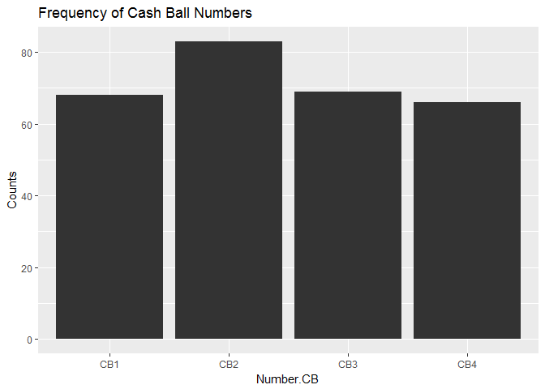

DA607\_Prj2\_2
================
Yun Mai
March 11, 2017

Lottery Winning Numbers
=======================

load packages

``` r
library(RCurl)  
```

    ## Loading required package: bitops

``` r
library(tidyr)
```

    ## 
    ## Attaching package: 'tidyr'

    ## The following object is masked from 'package:RCurl':
    ## 
    ##     complete

``` r
library(dplyr)  
```

    ## Warning: package 'dplyr' was built under R version 3.3.3

    ## 
    ## Attaching package: 'dplyr'

    ## The following objects are masked from 'package:stats':
    ## 
    ##     filter, lag

    ## The following objects are masked from 'package:base':
    ## 
    ##     intersect, setdiff, setequal, union

``` r
library(knitr)
library(stringr)
```

    ## Warning: package 'stringr' was built under R version 3.3.3

``` r
library(ggplot2)
```

    ## Warning: package 'ggplot2' was built under R version 3.3.3

``` r
url <-"https://raw.githubusercontent.com/YunMai-SPS/DA607-homework/master/Prj2_Lottery_Cash_4_Life_Winning_Numbers__Beginning_2014.csv"
lottery<- read.csv(url,header = T, fill = T)
View(lottery)
```

Tidy the raw data

``` r
lot_tidy <- lottery %>% 
  mutate(Date = (as.Date(trimws(Draw.Date, "b"),"%m/%d/%Y"))) %>% 
  separate(Date,into=c("Month", "Day", "Year"),sep ="\\/") 
```

    ## Warning: Too few values at 286 locations: 1, 2, 3, 4, 5, 6, 7, 8, 9, 10,
    ## 11, 12, 13, 14, 15, 16, 17, 18, 19, 20, ...

``` r
lot_tidy <- separate(lottery, Winning.Numbers, c("Win.No1","Win.No2","Win.No3","Win.No4","Win.No5"), sep = " ") 
lot_tidy[,2:6] <- lapply(lot_tidy[,2:6], as.numeric)

lot_sub1 <- subset(lot_tidy,select = -Cash.Ball)
derive <- as.data.frame(rowSums(lot_sub1 == 1))
for(i in 2:60){
  derive1 <- as.data.frame(rowSums(lot_sub1 == i))
  derive <- cbind(derive,derive1)
}
n1 <- as.character(c(1:60))
colnames(derive) [c(1:60)]<- n1
lot_mid <- cbind(lot_tidy,derive)

lot_sub2 <- subset(lot_tidy,select = -c(Win.No1,Win.No2,Win.No3,Win.No4,Win.No5))
derive2 <- as.data.frame(rowSums(lot_sub2 == 1))
for(i in 2:4){
  derive3 <- as.data.frame(rowSums(lot_sub2 == i))
  derive2 <- cbind(derive2,derive3)
}
colnames(derive2) [c(1:4)]<- c("CB1","CB2","CB3","CB4")
lot_ana <- cbind(lot_mid,derive2)

# calculate the frequency of winning numbers
lot_ana1 <- lot_ana %>% 
  gather(Number.Win, Counts.Win, 8:67) %>% 
  group_by(Number.Win) %>% 
  summarize(Sum.Win = sum(Counts.Win), Median.Win = median(Counts.Win), Qutile25.Win = quantile(Counts.Win,0.25), Qutile75.Win = quantile(Counts.Win,0.75), Min.Win = min(Counts.Win), Max.Win = max(Counts.Win))  

# calculate the frequency of cash ball numbers
lot_ana2 <- lot_ana %>% 
  gather(Number.CB, Counts.CB, 68:71) %>% 
  group_by(Number.CB) %>% 
  summarize(Sum.CB = sum(Counts.CB), Median.CB = median(Counts.CB), Qutile25.CB = quantile(Counts.CB,0.25), Qutile75.CB = quantile(Counts.CB,0.75), Min.CB = min(Counts.CB), Max.CB = max(Counts.CB))  
```

Frequency of winning numbers

``` r
lot_ana1 %>% 
  ggplot(aes(x=Number.Win,y=Sum.Win))+
  geom_bar(stat = "identity", fill = "dark blue", colours = "black")+
  labs(y = "Counts", title = "Frequency of Winning Numbers")
```

    ## Warning: Ignoring unknown parameters: colours


``` r
lot_ana2 %>% 
  ggplot(aes(x=Number.CB,y=Sum.CB))+
  geom_bar(stat = "identity", fill = "grey20", colours = "black")+
  labs(y = "Counts", title = "Frequency of Cash Ball Numbers")
```

    ## Warning: Ignoring unknown parameters: colours


